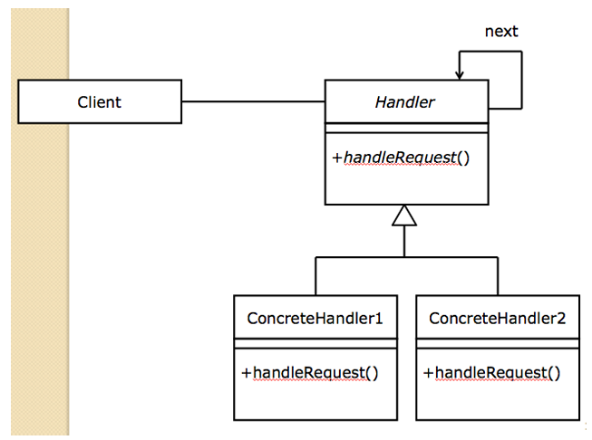
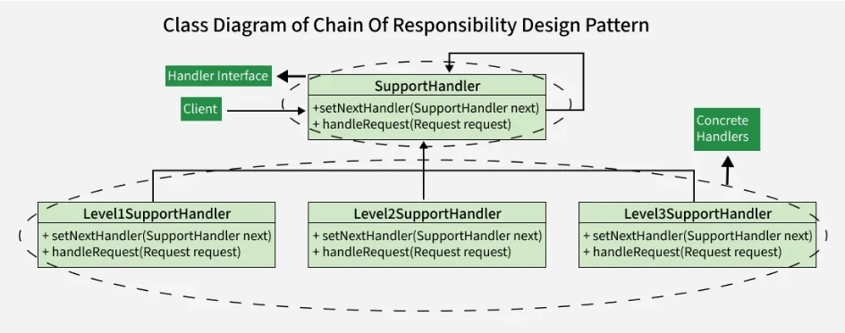

# Chain of Responsibility Pattern

* ### Chain of objects that are responsible for handling requests -> Handler objects that are linked together
* ### Client object sends a request -> First handler process it -> If handler can process it, the request ends with that handler
* ### If the first handler cannot process -> request sends to the next handler -> .... -> process continue until a handler can process the request
* ### Entire chain is unable to handle the request -> Request is not satisfied

#
## Importance
* ### Avoid coupling the sender to the receiver -> Give more than one object a chance to handle the request
* ### Handle streams of different requests

#
## Usage 
* ### Filtering objects, such as putting certain emails into a spam folder

## Similarity with Exception Handling
* ### When an exception occurs, it is expected to handle by one of the series of try/catch blocks written

#
### Handling end prematurely => A rule in a handler doesn't match but forgets to pass the request on to the next filter
### Need to follow these steps
### 1. Check if the rule matches
### 2. If it matches, do something specific
### 3. If it doesn’t match, call the next filter in the list

#
## Typical chain of responsibility Diagram

* ### Abstract superclass Handler -> common method 'handleRequest()'
* ### Handle objects are connected from one to the next in the chain
* ### Subclasses of Handler handle requests in their own way

#
## Chain of responsibility Class Diagram

