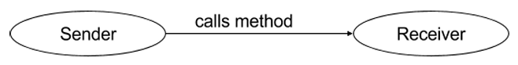
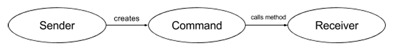
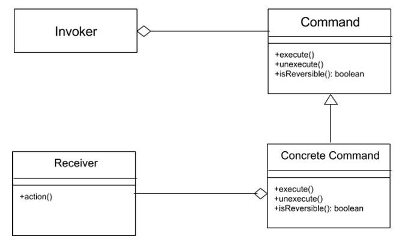

# Command Pattern

* ### Encapsulates a request as an object of its own
* ### General Communication (Request) -> First object call a method of the second object and the second object would complete the task.

* ### The command pattern creates a command object between the sender and receiver.
* ### The sender does not have to know about the methods to call

* ### Invoker -> Make the command object to do what it's supposed to do and get the specific receiver object to complete the task.
* ### (Object thea invokes the command objects to complete a task)
* ### Command Manager -> Keep track of the commands, manipulate them, and invoke them

#
## Purposes of the Command Pattern

* ### Store and Schedule different requests
    * ### Can be stored into lists and manipulated before they are completed
    * ### Placed onto a queue and schedule to be completed at different times
    * ### Eg: An alarm ring in a calender
* ### Allow commands to be undone and redone
    * ### Eg: Undone and Redone edits in a document
    * ### A history list -> hold all command that have been executed
    * ### A redo list -> hold commands that have been undone
    * ### When a command is completed, it goes to history list. If want to undo a command, go to history list and undo the most recent command and put into redo list
    * ### When need to redo, take the most recent command undone from the redo list, and move it to the history list again.
    * ### Empty the redo list everytime a new command executed -> Can't redo a previous edit after a new edit is made
* ### Store in a log -> if the software crashes unexpectedly, users can redo all the recent command

#
## UML Diagram of Command Pattern

* ### All commands are instances of subclasses of the command superclass
* ### Superclass defines the common behaviors of commands 

#
## Benefits

* ### Allow commands to be manipulated as objects -> Add functionalities
* ### Decouple objects -> Classes do not need to know about other objects. The command object deals with the work by invoking receiver objects. Original object does not need to know what other objects are involved in the request
* ### Allow logic to be pulled from the UI -> UI classes only deal with issues like getting information to and from the user, and application logic should not be in UI classes
* ### Each service in a system can be an object of its own, allowing for more flexible functionality