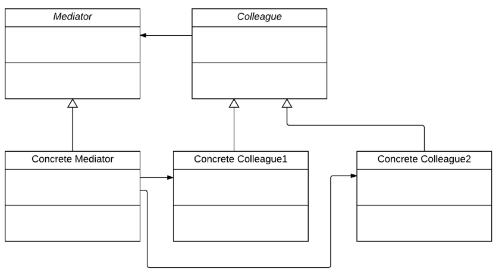

# Mediator Pattern

* ### An object will talk to other objects and coordinate their activities
* ### All interact through the Mediator: instead of objects engaged in various pairwise interactions
* ### Objects inform the mediator when something happens -> Mediator can perform logic on these events -> Mediator request information or behaviour from an object

#
## Implementation

* ### Colleagues -> Objects associated with the mediator
* ### An interface, keep the interactions between the mediator and colleagues
* ### Instantiate a concrete mediator and concrete colleagues
* ### Communication implemented as an Observer pattern
* ### Each colleague is a subclass of the Observer class, and the Mediator is an Observer to each of them
* ### The colleague should pass itself as a parameter to the mediator, so that the mediator knows to check that colleague
* ### Communication occur through an event infrastructure

#
## Usage

* ### Loose couple between colleagues
* ### Reuse colleagues
* ### Centralizing the logic -> One central object makes for code 
