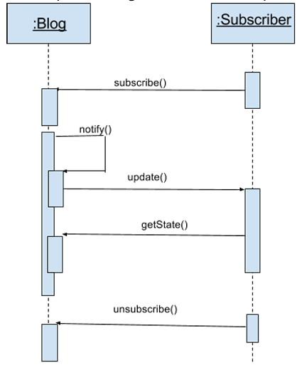
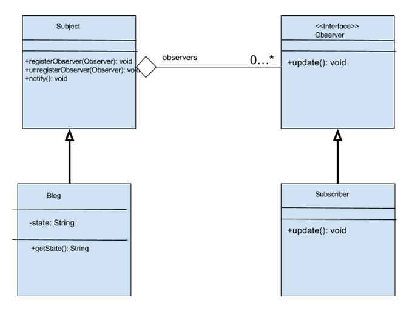

# Observer Pattern

* ### A subject keeps a list of observers
* ### Observers rely on the subject to inform them of changes to the state of the subject

#
## Observer pattern structure

* ### Subject superclass -> Have an attribute to keep track of all observers
* ### Observer interface -> Observer can be notified of the state changes to the subject
* ### Subclasses of the subject superclass -> implement the observer interface, create the relationship between the subject and observer

#
## Blog Example 

* ### Subject (the blog) & Observer (a subscriber)
* ### subject-observer relationship -> Subscriber must subscribe to the blog
* ### The blog then needs to be able to notify subscribers of a change
* ### The notify function keeps subscribers consistent and is only called when a change has been made to the blog
* ### If a change is made, the blog will make an update call to update subscribers
* ###  Subscribers can get  the state of the blog through a getState() call

