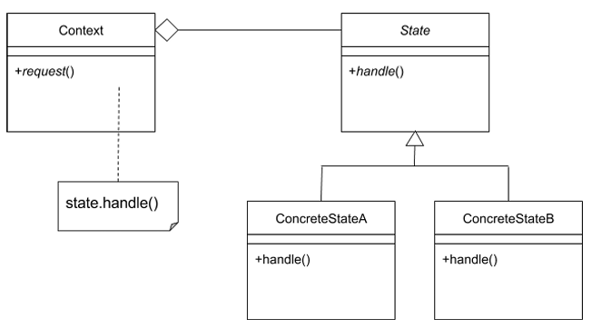
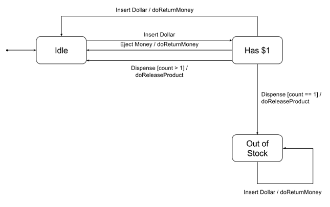
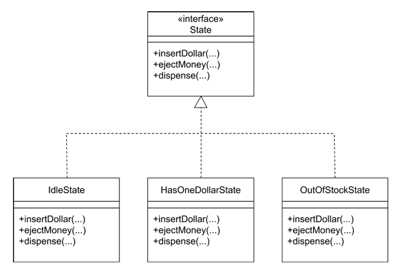

# State Pattern

* ### Objects can choose an appropriate behavior based on their current IState
* ### When current IState change -> behavior can be altered
* ### Use when need to change the behavior of an object based upon changes to its internal IState or the IState it is in at run-time
* ### Simplify methods with long conditionals that depend on the object's IState

#
## General Structure of a IState pattern

#
## Vending Machine Example (3-states)

### 1. Idle IState -> Before being approached
### 2. When a dollar is inserted, either dispense a product or return the money upon receiving an eject money request
### 3. Machine is out of stock

* ### Each IState could be represented as IState objects
* ### In this scenario, State objects are passive -> Don't have much responsibility themselves

## Vending Machine State Diagram

## Vending Machine UML Diagram
