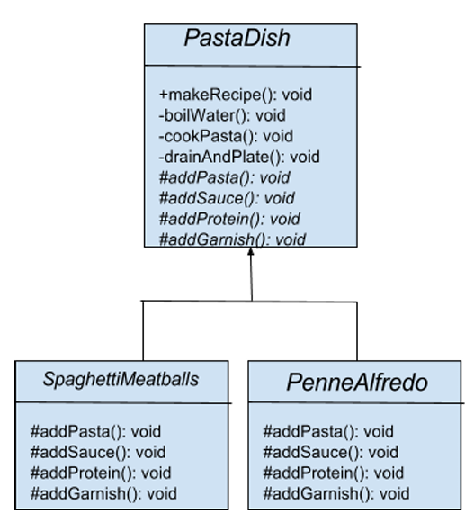

# Template Pattern

* ### Define algorithm's steps -> deferring the implementation of some steps to subclasses
* ### Concerned with the assignment of responsibilities
* ### Generalize between two classes into a new superclass
* ### Differences in algorithms would be done through calls to abstract methods whose implementations are provided by the subclass

## Pasta Dish Example

* ### Instructions are provided for making popular dish -> Ensure dishes at all the restaurant locations are consistent

