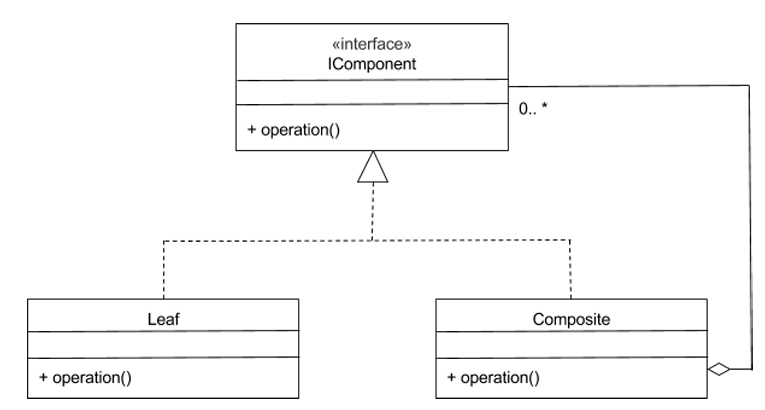
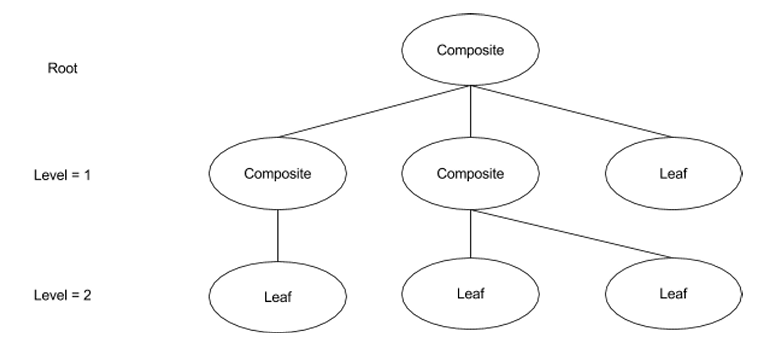
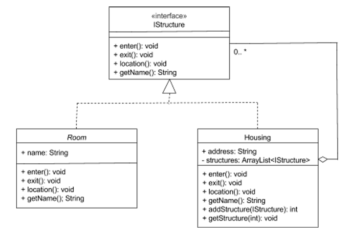

# Composite Pattern

* ### A structural design pattern

## Main goal of the pattern

### 1. Compose nested structures of objects
### 2. Deal with the classes for these objects uniformly

## Basic Composite design

* ### Composite Class - Use to aggregate any class the implements / 'traverse through' and 'potentially manipulate' the component objects that the composite object contains.
* ### Leaf Class - A non-composite type. It is not composed of other components

###

### The leaf class and composite class implements the component interface - allow to deal with non-composite and composite objects uniformly
### Leaf class and Composite class -> Subtypes of Component

### *Recursive Composition* - composite object can contain other composite objects since the composite class is a subtype of the component

## Composite class with a cyclical Nature

* ### Leaf objects cannot have components added to them - Ends the tree => unified components
* ### Composites have the ability to grow => Complex structures

## UML diagram for Composite pattern example

