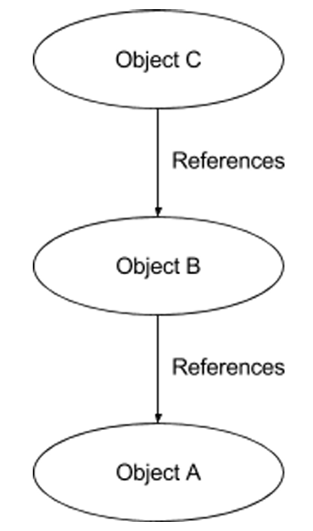
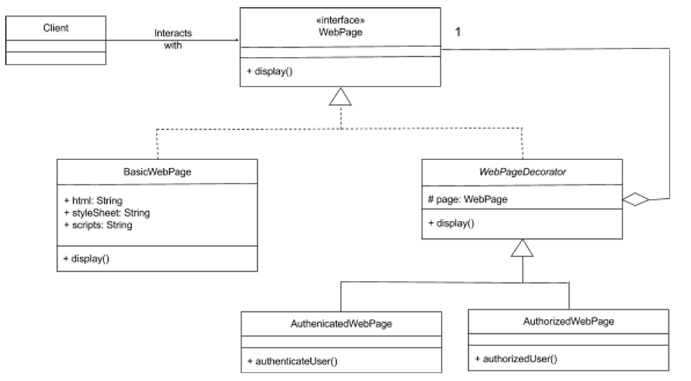

# Decorator Pattern

* ### Changes to classes can not be made while a program is running -> behavior of an object is defined by its class and only occurs at compile time
* ### A new class would need to be created in order to achieve a new combination of behaviors while a program is running

* ### Decorator design pattern -> A structural design pattern
* ### Allows additional behaviors or responsibilities to be dynamically attached to an object by using aggregation to combine behaviors at run time

## Aggregation 

* ### A design pattern
* ### Represent a 'has-a' or 'weak containment' relationship between two objects
* ### Use to build 'Aggregation Stack' -> Each level of the stack contains an object that knows about its own behavior and augments the one underneath it

### A is a base object. B aggregates A, allowing B to 'augment' the behavior of A.  

* ### The aggregation relationship is always one-to-one in decorator -> Allows the stack to build-up, so one object is on top of another.
* ### An overall combination of behaviors for stacked objects can be achieved by calling the top element. 

## Coherent combination of behavior

* ### Use interfaces and inheritance -> classes conform to a common type whose instances can be stacked in a compatible way

## Adapter design pattern steps

### 1. Design the component interface
### 2. Implement the interface with the base concrete component class.
### 3. Implement the interface with the abstract decorator class.
### 4. Inherit from the abstract decorator and implement the component interface with concrete decorator classes.

## Web page Example

* ### Only allow access to authorized users
* ### Split search results across multiple pages
* ### Many possible combination of web page permission, pagination, and caching behavior

