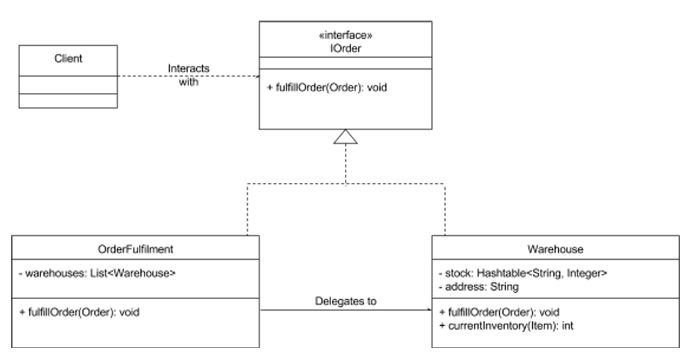

# Proxy Pattern

* ### Allows a proxy class to represent a real "subject class"
* ### Structural design pattern

## Proxy ->

* ### Act as a simplified, or lightweight version of the original object
* ### Can perform the same tasks as an original object but may delegate requests to the original object to achieve them.

## Proxy Class as a Wrapper

* ### A reference to an instance of the real subject class is hidden in the proxy class
* ### Client classes interact with proxy class instead of the real subject class
* ### Real object -> Contain sensitive information, resource-intensive to instantiate

## Main proxy scenarios

* ### Virtual proxy => When real subject class is resource-intensive to instantiate
  * Eg: Images in web pages or graphic editors, as a high-definition image may be extremely large to load
* ### Protection proxy => To control access to the real subject class
  * Eg: A system that is used by both students and instructors might limit access based on roles
* ### Remote proxy => When a proxy class is local, and the real subject class exists remotely
  * Eg: Google docs - Web browsers have all the objects it needs locally, which also exist on a Google server somewhere else

## Polymorphism

* ### Proxy class wraps, and may delegate, or redirect, calls upon it to the real subject class
* ### Not all classes are delegated -> Proxy class can handle some of its lighter responsibilities
* ### Therefore, the proxy class must offer the same methods -> Both classes implement a common subject interface (Polymorphism)
* ### The proxy and real subject classes are subtypes of the subject

## Adapter design pattern steps

### 1. Design the subject interface
### 2. Implement the real subject class
### 3. Implement the proxy class

## Online Retail store example

* ### Need to determine which warehouse to send orders to
* ### Routes orders for fulfillment to an appropriate warehouse will prevent your warehouses from receiving orders that they cannot fulfill
* ### A proxy protect warehouse from receiving orders if the warehouses do not have enough stock to fulfill an order

